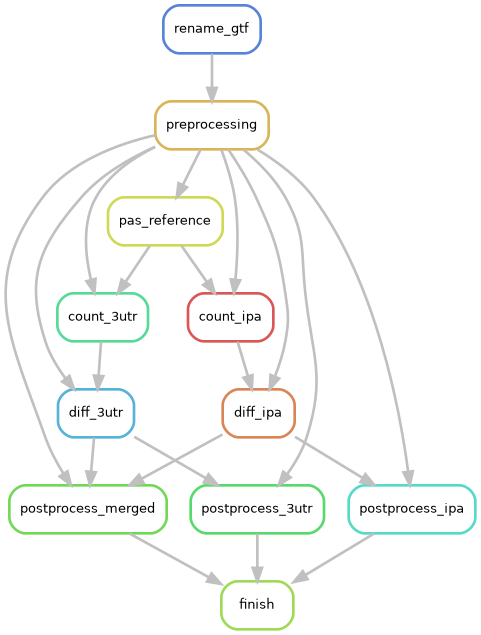

# APAlyzer
APAlyzer utilizes the PAS (polyadenylation sites) collection in the [PolyA_DB database](http://polya-db.org/polya_db/v3/) to examine APA (alternative polyadenylation) events in all genomic regions,
including 3′UTRs and introns.

Sources:
- [Publication](https://academic.oup.com/bioinformatics/article/36/12/3907/5823886)
- [Source code](https://bioconductor.org/packages/release/bioc/html/APAlyzer.html)
- [Software manual](https://bioconductor.org/packages/release/bioc/manuals/APAlyzer/man/APAlyzer.pdf)
- [Github repo](https://github.com/RJWANGbioinfo/APAlyzer)
- [Github analysis example](https://github.com/RJWANGbioinfo/APAlyzer#complete-analysis-example-apa-analysis-in-mouse-testis-versus-heart)

## APAlyzer method workflow run instructions

### Input file
Required files are to be specified in the input `config/samples.csv`. 
Each row in the sample sheet has two columns:

- condition: name of the condition (e.g control)
- sample: name of the sample (e.g. control_replicate1)
- bam: relative path from APAlyzer working directory / absolute path to the
       BAM input file for the sample

It is important to name samples of the same condition with the exact condition name under the condition
column since samples are grouped per condition to be processed by APAlyzer.

### Setting parameters in the config file
Parameters used to run APAlyzer are specified in `config/config.APAlyzer.yaml`.
In the config file, users are able to specify the output directory and output
file name: `out_dir, differential_output_file`. `out_dir` may be given as either
a relative path (resolved from the APAlyzer working directory) or an absolute path. <br>

In addition, the relative path from the working directory to the input sample file 
from the previous step is to be specified with parameter `sample_file`. <br>

Other parameters that are important to specify for each run are the
path to GTF annotation file and GTF annotation file organism, 
genome version, and ensemble version details: 
`gtf, gtf_organism, gtf_genome_version, gtf_ensemble_version`.

#### Counting parameters
`strandtype` is passed to both counting steps and describes the strandedness of the
input BAM files (`forward`, `invert` or `NONE`).

The intronic APA (IPA) counting step exposes three further parameters:

- `ipa_threads`: number of threads used for counting (APAlyzer's `nts`). This is also
  used as the Snakemake `threads` value for the `count_ipa` rule.
- `ipa_min_mqs`: minimum mapping quality score of the reads to be counted (`minMQS`).
- `ipa_seq_type`: `SingleEnd` for single-end libraries, or `ThreeMostPairEnd` for
  paired-end libraries (`SeqType`).

`read_cutoff` is the minimum read count applied by `APAdiff` in the differential steps.

#### Reusing GTF-derived files across runs
Two of the workflow's intermediate files depend only on the GTF annotation, and are by far
the slowest parts of the pipeline to generate. Both only need to be generated once per GTF
file and can then be reused across runs.

**PAS reference regions.** The `pas_reference` rule writes the reference regions built by
`PAS2GEF()`/`REF4PAS()` to `<out_dir>/pas_reference.RData`. To reuse the file from a previous
run, set:

```yaml
use_precomputed_pas_reference: True
precomputed_pas_reference: "path/to/pas_reference.RData"
```

The `pas_reference` rule is then dropped from the DAG and the counting rules read the
provided file directly.

**gene_name to gene_id table.** Preprocessing builds a lookup table mapping gene symbols to
gene ids by parsing the GTF attributes column, which is the slowest step of preprocessing.
To supply it instead as a CSV file with (at least) the columns `gene_name` and `gene_id`, set:

```yaml
use_precomputed_gene_dict: True
precomputed_gene_dict: "path/to/gene_dict.csv"
```

For example, such a table can be generated from a GENCODE/Ensembl GTF file with:

```bash
awk -F'\t' '$1 !~ /^#/ && $3 == "gene"' annotation.gtf \
  | sed -n 's/.*gene_id "\([^"]*\)".*gene_name "\([^"]*\)".*/\2,\1/p' \
  | sort -u \
  | sed '1i gene_name,gene_id' > gene_dict.csv
```

If either `use_precomputed_*` flag is set to `True` without a corresponding path, or the path
does not exist, the workflow fails at DAG construction with an explanatory error.

### Setting up the environment
To run the method workflow, we first need to activate `apaeval` conda environment
following the instructions on [APAeval README](https://github.com/iRNA-COSI/APAeval#conda-environment-file).

### Running the workflow
Before running, you can perform a 'dry run' to check which steps will be run and where output files will be 
generated given the provided parameters and input sample file:

```
bash dryrun.sh
```

To run the workflow locally, you can use the provided wrapper script `run_local.sh` which executes with singularity.

```
bash run_local.sh
```

**Note: The run_local.sh script is currently set up to run with the APAeval test data**. 
If you have specified **absolute paths** in your sample sheet (e.g. `config/samples.csv`) or the config file (`config/config.DaPars2.yaml`), 
or have input data that is **not in the current directory**, you will need to modify Singularity bind arguments so the 
input files will be available to the container.

e.g. The path to the input GTF file is `/share/annotation/annotation.gtf`, and my current working directory is `/home/sam/DaPars2_snakemake/`. 
Modify the `--singularity-args` line in `run_local.sh` like below to ensure the file is available to the container:

```
--sigularity-args="--bind /share/" \
```

For remote / cluster runs, note that APAlyzer tool by default wants to cache data under /data (which apptainer/singularity containers usually don't have access to on shared systems.) One workaround is to add a bind to a temporary directory in your scratch space in the singularity arguments i.e.

```bash
TMP_DATA_MOUNT_DIR=/scratch/myusername/apalyzer-tmp-dir/
mkdir -p $TMP_DATA_MOUNT_DIR
snakemake -p ... \
--use-singularity \
--singularity-args "--bind $TMP_DATA_MOUNT_DIR:/data"
```

If you are satisfied with the bind arguments, you can run the workflow locally by doing `bash run_local.sh`

### Output & post-processing
The output of APAlyzer qualifies for _differential challenge_.
The 3'UTR APA and intronic APA (IPA) analyses are run as separate branches of the workflow
and are postprocessed both separately and merged. All output is written to `out_dir` as
specified in the config file `config/config.APAlyzer.yaml`:

| File | Description |
| --- | --- |
| `differential_output_file` (e.g. `differential_challenge_output.tsv`) | **Differential challenge output.** Gene ids and pvalues for the merged 3'UTR APA + IPA results. Where a gene id occurs in both branches, the smaller pvalue is reported. No header. |
| `<stem>.3utr.tsv` | As above, for the 3'UTR APA analysis only |
| `<stem>.ipa.tsv` | As above, for the IPA analysis only |
| `diff_3utr.tsv` | Full `APAdiff()` results table for the 3'UTR APA analysis (all columns, with a header) |
| `diff_ipa.tsv` | Full `APAdiff()` results table for the IPA analysis (all columns, with a header) |

where `<stem>` is `differential_output_file` with its extension removed.

The workflow additionally writes the following intermediate RData files to `out_dir`:
`preprocessing.RData`, `pas_reference.RData` (reusable, see above), `counts_3utr.RData`,
`counts_ipa.RData`, `diff_3utr.RData` and `diff_ipa.RData`.

## Rulegraph
The rulegraph gives an overview of the steps of the workflow. 
To obtain it, adapt and run the `rulegraph.sh` script.
The current rulegraph is:



## Author contact
If you have any question or comment about APAlyzer, please contact 
Dr. Ruijia Wang (rjwang.bioinfo@gmail.com).

## Known issues / candidates for future fixes

The following pre-existing issues were identified while refactoring the workflow but were
deliberately left untouched so that the refactor does not change results. They are recorded
here with proposed fixes for future work.

### `workflow/scripts/APAlyzer_preprocessing.R`

1. **The GTF file is read with a header.** The `gene_dict` is built with
   `read.csv(file = GTFfile, sep = '\t', comment.char = '#')`, which treats the first GTF
   record as a header row, so one annotation record is silently dropped. There is also no
   `quote = ""`, so attribute values containing quotes can be mis-parsed.
   *Proposed fix:* `read.delim(GTFfile, header = FALSE, quote = "", comment.char = "#")`.
2. **`gene_dict` construction is very slow.** The nested `for` / `str_split` loop is
   `O(records x attributes)` in interpreted R and dominates preprocessing runtime on a
   full annotation. The `use_precomputed_gene_dict` config option works around this, but
   the fallback path is still slow.
   *Proposed fix:* subset to `V3 == "gene"` and extract both attributes vectorised, e.g.
   `sub('.*gene_id "([^"]*)".*', "\\1", attrs)` / `sub('.*gene_name "([^"]*)".*', "\\1", attrs)`,
   then build the hash in one `hash(keys = , values = )` call.
3. **`condition_counts` is wrong for more than one replicate per condition.** It is built by
   a quadratic loop over the *unsorted* `conditions` vector and yields a vector of length
   `sum_over_samples(count(condition))` rather than the number of samples — e.g. 8 entries for
   a balanced 2x2 design. It only works because the shipped test data has exactly one replicate
   per condition. It also disagrees with `flsall`, which is sorted by condition, so the sample
   to condition assignment in `sampleTable` can be wrong even when the lengths happen to match.
   *Proposed fix:* after `df = df[order(df$condition),]`, use `condition_counts = df$condition`.
4. **Undefined variable in the sample file column check.** The `stop()` in the column name
   check references `actual_colnames`, which is never defined, so the error handler itself
   errors instead of reporting the problem.
   *Proposed fix:* use `colnames(df)`.
5. **Misleading condition count error message.** The message reports `length(conditions)`
   (the number of samples) rather than the number of unique conditions.
   *Proposed fix:* report `length(unique_conditions)`.

### `workflow/scripts/APAlyzer_diff_3utr.R` / `APAlyzer_diff_ipa.R`

6. **Single-row results tables are silently discarded.** The guard is
   `if (nrow(<counts>) > 1)`, so a counting result with exactly one row is treated as if there
   were no results at all.
   *Proposed fix:* `if (nrow(<counts>) > 0)`.
7. **`read_cutoff` is passed to `APAdiff()` as a character string.** The `--read_cutoff`
   option is declared with `type = "character"` and is handed straight to `CUTreads =`.
   *Proposed fix:* declare the option as `type = "integer"` (or `as.numeric()` it before use).

### `workflow/scripts/APAlyzer_postprocessing.R`

8. **Gene symbols missing from `gene_dict` break the loop.** `gene_dict[[gene_symbol]]`
   returns `NULL` for an unknown symbol, which then errors in `has.key()`/assignment.
   *Proposed fix:* skip (with a warning) any row whose gene symbol is not in `gene_dict`.
9. **Output row order is arbitrary.** `hash` keys are unordered, so the row order of the
   output tsv file is not stable between runs.
   *Proposed fix:* sort the final data frame by gene id (or by pvalue) before writing.
10. **`NA` pvalues are not filtered.** Rows for which `APAdiff()` could not compute a pvalue
    are written out as `NA`.
    *Proposed fix:* drop `NA` pvalues before building the output table.
11. **Dead code.** `df.df` is computed and never used; the un-coerced `df` is written instead.
    *Proposed fix:* delete the `df.df` line.

### `workflow/envs/Dockerfile`

12. **The image is not reproducible.** Neither the `r-base:latest` base image nor the APAlyzer
    GitHub revision (`RJWANGbioinfo/APAlyzer`, installed from the default branch) is pinned, so
    rebuilding the image does not necessarily reproduce `apaeval/apalyzer:1.0.6`.
    *Proposed fix:* pin the base image to a dated tag and install APAlyzer at a fixed
    commit/release tag.
